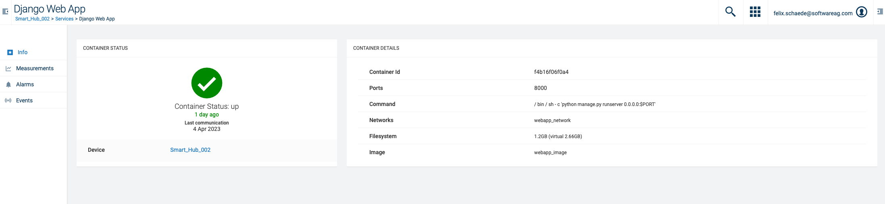
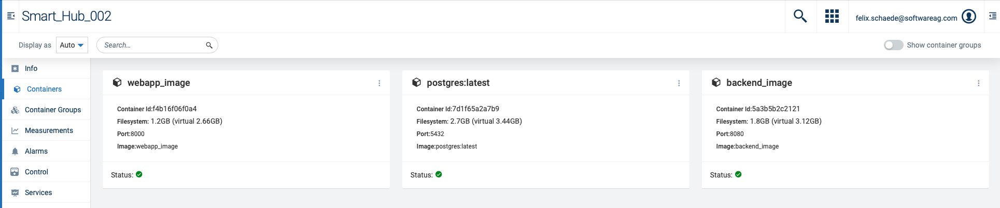
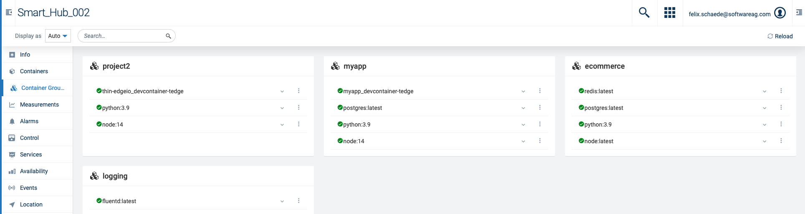

# Cumulocity thin-edge.io container plugin UI.

UI for the tedge-container-plugin ([Link](https://github.com/thin-edge/tedge-container-plugin)) to monitor installed containers and container groups.

## Plugin summary

---

The plug-in containers 3 tabs that can be added to the device-management application.

| Plug-In                        | Function                                                                                                                   |
| ------------------------------ | -------------------------------------------------------------------------------------------------------------------------- |
| Container Info Tab             | Adds a tab to a container service to display all relevant container information.                                           |
| Container Management Tab       | Adds a tab to the device to monitor containers. The tab can include/exclude the containers hosted within container groups. |
| Container Group Management Tab | Adds a tab to the device to monitor container groups (aka. docker compose).                                                |

### Container Info Tab

The tab will be enabled for all services of type container. Displays the container properties that are stored in the managed Object.



### Container Management Tab

The tab will be enabled for all devices with a childAddition with serviceType=container or serviceType=container-group. Lists all containers in a grid or list.The search can be used for the image name and the project id. The list can include/exclude the containers that are part of a container group.



### Container Group Management Tab

The tab will be enabled for all devices with a childAddition with serviceType=container or serviceType=container-group. Lists all containers that are part of a project. The filter/search can be used to search for project names or container images.



## Developers

### Building the UI

To build the ui use the following steps:

1. Checkout the project

2. Install dependencies:

   ```sh
   npm install
   ```

3. (Optional) Run the UI locally.

   Add your tenant in the package.json file:

   ```json
    "scripts": {
    "start": "c8ycli server -u https://{{add the url of your tenant here}} --shell devicemanagement",
    ...
    }
   ```

   Start the UI locally via:

   ```sh
   npm start
   ```

4. Build the Plugin

   ```sh
    npm run build
   ```

5. Deploy the Plugin

   ```sh
   npm run deploy
   ```
